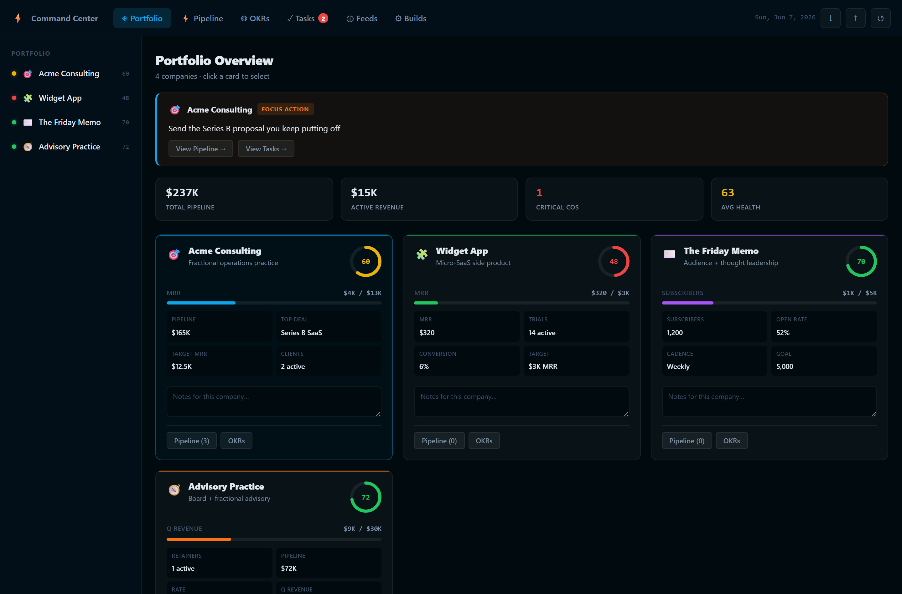

# ⚡ Command Center

**A self-updating business dashboard with an automated daily email brief.** Open it offline in one click. Let it brief you every morning before you wake. It runs on plain files. No server, no subscription, no vendor deciding what you see.

Free and open source. Take it, make it yours, share it.



---

## What it does

- **A dashboard you double-click open.** Works offline, opens instantly. Your companies or projects, pipeline, goals, tasks and live news feeds on one screen. Edit it directly; it remembers your edits.
- **An engine that runs while you sleep.** On a schedule, it pulls fresh news from the sources you chose, rebuilds the dashboard's data and emails you a brief.
- **A morning brief in your inbox.** Top 3 actions today, what is due this week, where each part of the business stands, the headlines that matter and any risk flags.

To make it yours, you change **one file**: `scripts/data.mjs`.

---

## Quick start

Requires [Node.js](https://nodejs.org) 20 or newer.

```bash
git clone https://github.com/YGK13/command-center.git
cd command-center
npm install

# 1. Put your business in scripts/data.mjs (sample data is provided)
# 2. Build the dashboard data (fetches your news feeds)
npm run refresh
# 3. Open the dashboard
npm run open
```

That is the whole dashboard, working offline. To turn on the **daily email brief**:

```bash
cp .env.example .env       # then add a Gmail App Password (see below)
npm run verify-email       # check the credentials
npm run brief              # send yourself the brief right now
```

To make it arrive automatically every morning, see [Scheduling](#scheduling).

---

## How it works

```
  SOURCE OF TRUTH  ──►  ENGINE  ──►  data.js  ──►  index.html
   scripts/data.mjs    (gather +    (snapshot)    (dashboard)
                        compose)
                           │
                           └──►  EMAIL BRIEF (your inbox)
```

You edit the **Source of Truth**. The **Engine** runs each morning, pulls your news feeds, writes a **snapshot** (`data.js`) and emails the **brief**. The **dashboard** just reads the snapshot, which is why it is fast and always opens, even offline.

**The one rule that makes it reliable:** the thing you open is a static file that never depends on a server. The engine is separate and only needs to run once a day. If the engine fails one morning, yesterday's dashboard still opens.

---

## Commands

| Command | What it does |
|---|---|
| `npm run refresh` | Rebuild `data.js` (fetch feeds + read notes). No email. |
| `npm run brief` | Full run: refresh + email the brief. |
| `npm run brief:dry` | Full run, print the brief, send nothing. |
| `npm run verify-email` | Check your email credentials. |
| `npm run open` | Open the dashboard. |
| `npm run shots` | Recapture the dashboard screenshots (needs Chrome + `puppeteer-core`). |

---

## Email setup (Gmail)

The brief sends through your Gmail using an **App Password** (a 16-character token, not your login password).

1. Turn on **2-Step Verification** for your Google account.
2. Create an App Password at <https://myaccount.google.com/apppasswords>.
3. Copy `.env.example` to `.env` and paste it in:
   ```
   GMAIL_USER=you@gmail.com
   GMAIL_APP_PASSWORD=xxxxxxxxxxxxxxxx
   BRIEF_TO=you@gmail.com
   ```
`.env` is gitignored and never committed.

---

## Scheduling

**Windows (Task Scheduler):**
```powershell
powershell -ExecutionPolicy Bypass -File setup\install-scheduler.ps1
```
Runs `Sunday–Friday at 7:00 AM` by default. Edit `-DaysOfWeek` and `-At` in the script to change it.

**Mac / Linux (cron):**
```bash
crontab -e
# then add (runs Sun–Fri at 7am):
0 7 * * 0-5 cd /path/to/command-center && node scripts/daily-brief.mjs
```

---

## The build guide (learn it, or teach it)

The `/teaching` folder is a complete, illustrated guide to building this from scratch, suitable for teaching to others:

- **`Command-Center-Field-Guide.html`** — the illustrated walkthrough: diagrams, screenshots, every build step, a No-Code track and a teaching kit. Open it in any browser.
- **`Command-Center-Field-Guide.pdf`** — a portable version to read or print.
- **`Command-Center-NoCode-Template.xlsx`** — a prebuilt spreadsheet version for non-technical users, with an auto-calculating dashboard and health colors.
- **`COMMAND-CENTER-PROTOCOL.md`** — the same guide in plain Markdown.

---

## Project structure

```
command-center/
├── index.html              the offline dashboard (double-click this)
├── scripts/
│   ├── data.mjs            YOUR DATA — the only file you edit
│   ├── build-data.mjs      writes data.js
│   ├── feeds.mjs           fetches + parses news feeds
│   ├── digest.mjs          reads your notes (optional)
│   ├── brief.mjs           composes the morning brief
│   ├── email.mjs           sends it via Gmail
│   ├── env.mjs             loads .env
│   └── daily-brief.mjs     the orchestrator the scheduler runs
├── setup/                  scheduler + screenshot + template scripts
└── teaching/               the build guide, PDF and No-Code template
```

---

## License

- **Code:** [MIT](LICENSE) — do anything you like.
- **The written guide** (`/teaching`): [CC BY 4.0](teaching/LICENSE-docs.md) — free to share and adapt, with credit to Yuri Kruman.

---

Built by [Yuri Kruman](https://www.linkedin.com/in/yurikruman/). If this is useful, share it.
